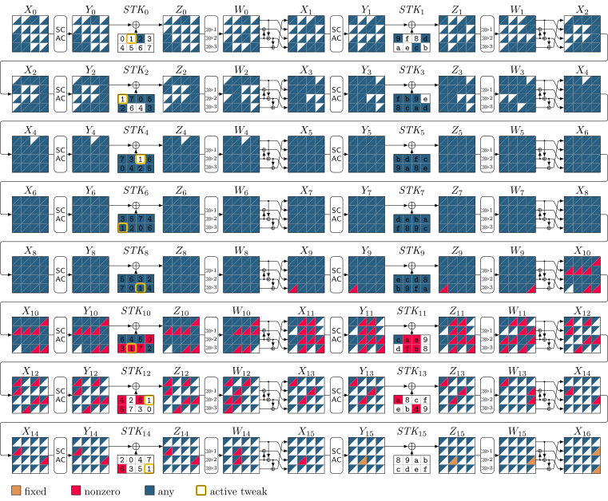
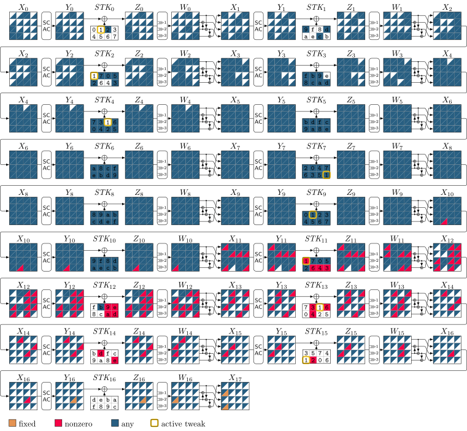
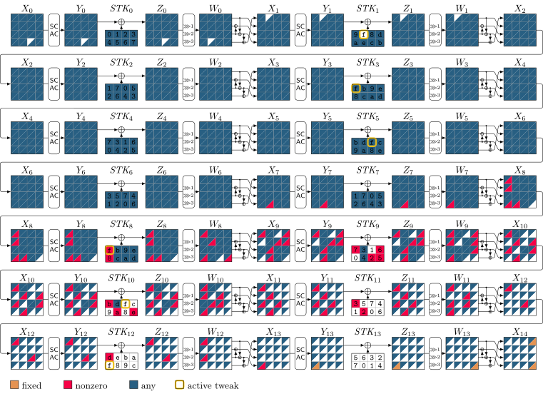
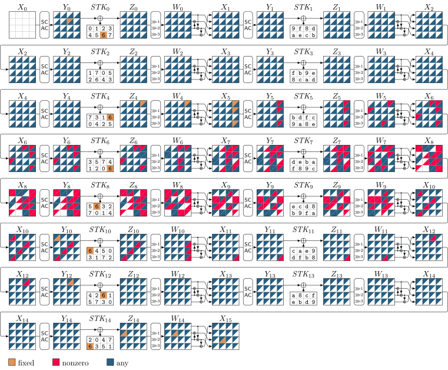
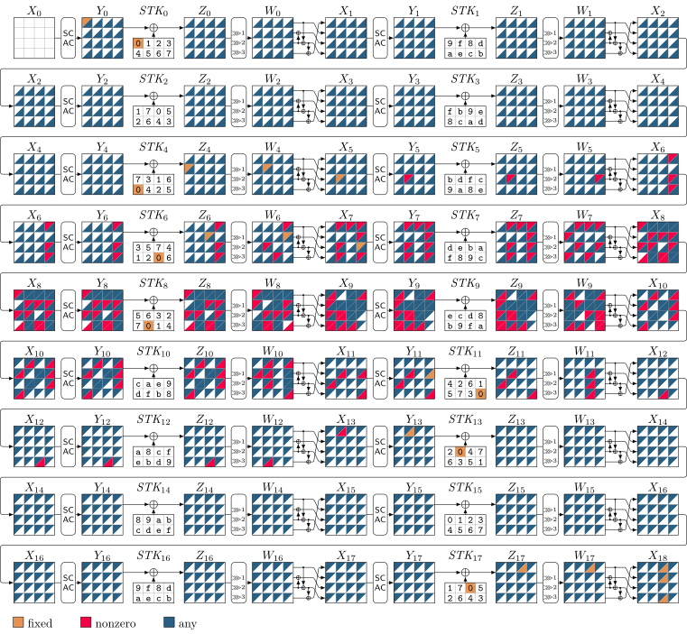
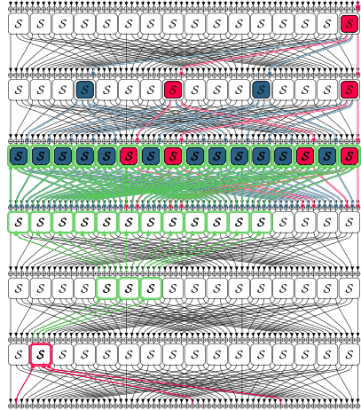

# Zeroplus


This repository includes the source code of the tools we used in our paper accepted for ToSC 2024/1 ([FSE 2024](https://fse.iacr.org/2024/)): [Improved Search for Integral, Impossible Differential and Zero-Correlation Attacks: Application to Ascon, ForkSKINNY, SKINNY, MANTIS, PRESENT and QARMAv2](https://tosc.iacr.org/index.php/ToSC/article/view/11408)


## Table of Contents

- [Zeroplus](#zeroplus)
  - [Table of Contents](#table-of-contents)
  - [Requirements](#requirements)
  - [Installation](#installation)
  - [Structure of Our Tool](#structure-of-our-tool)
  - [Usage](#usage)
  - [Searching for Integral Distinguishers](#searching-for-integral-distinguishers)
    - [SKINNY](#skinny)
    - [ForkSKINNY](#forkskinny)
    - [Experimental Verification of Integral Distinguishers](#experimental-verification-of-integral-distinguishers)
    - [QARMAv2](#qarmav2)
  - [Searching for a Complete Integral Attack](#searching-for-a-complete-integral-attack)
  - [Partial-sum Technique](#partial-sum-technique)
  - [Searching for ID/ZC Distinguishers](#searching-for-idzc-distinguishers)
    - [SKINNY](#skinny-1)
    - [ForkSKINNY](#forkskinny-1)
    - [PRESENT](#present)
    - [Ascon](#ascon)
  - [Searching for Complete ID Attacks](#searching-for-complete-id-attacks)
    - [ForkSKINNY](#forkskinny-2)
  - [Paper and Presentation](#paper-and-presentation)
  - [Disclaimer](#disclaimer)
  - [Citation](#citation)
  - [License ](#license-)


## Requirements

Our tool requires the following software:

- [Python3](https://www.python.org/downloads/) 
- [MiniZinc](https://www.minizinc.org/) to compile and solve our CP models
- [latexmk](https://www.latex-project.org/) to build the `.tex` file and generate the shapes of our attacks (can be replaced by just calling lualatex directly)

- [Or-Tools](https://developers.google.com/optimization)
 to solve our CP models.

- [Gurobi](https://www.gurobi.com/downloads/gurobi-software/) to count the number of ID distinguishers for ForkSKINNY and SKINNY. 

## Installation

Many CP solvers are bundled with MiniZinc and can be used without any further installation. 
We use Or-Tools as the CP solver. 
Fortunately, `OR Tools CP-SAT` is bundled with MiniZinc after version 2.8.0. Thus, by installing the latest version of MiniZinc, one can use `OR Tools CP-SAT` without any further installation.
Additionally, we need the Python package named `minizinc` to work with MiniZinc in Python. 
To install the required software in Ubuntu, one can use the following commands:

```bash
apt update
apt upgrade
apt install python3-full
apt install git
apt install wget
cd /home 
wget https://github.com/MiniZinc/MiniZincIDE/releases/download/2.8.1/MiniZincIDE-2.8.1-bundle-linux-x86_64.tgz
tar -xvzf MiniZincIDE-2.8.1-bundle-linux-x86_64.tgz
mv MiniZincIDE-2.8.1-bundle-linux-x86_64 minizinc
rm MiniZincIDE-2.8.1-bundle-linux-x86_64.tgz
ln -s  /home/minizinc/bin/minizinc /usr/local/bin/minizinc
apt install python3-pip
python3 -m pip install minizinc
```

## Structure of Our Tool

Our tool's main components are the CP models saved in `.mzn` format, built using the methods explained in our paper. You can solve these `.mzn` files independently with MiniZinc.

To make using our tool even more convenient, we have included a Python interface for each application. Thus you'll discover `.mzn` files for each application, along with some handy Python tools.

## Usage

Using our tool is straightforward. Simply specify the number of attacked rounds or the length of distinguisher and choose the solver. Our tool will then identify the attack and visualize its shape.

For a quick guide on each application, run the following command:

```bash
python3 <application_name>.py --help
```

We provide examples for each application below.

## Searching for Integral Distinguishers

### SKINNY

Assume that we want to search for a (ZC-based) integral distinguisher for SKINNY-n-3n. Navigate into [this folder](forkskinny/integral) and run the following command:

```bash
python3 distinguisher.py -v 3 -RD 16
```

The `-v` switch specifies the variant of SKINNY, and the `-RD` switch specifies the length of the distinguisher (see `python3 distinguisher --help`).
The following field shows the output of running the above command on a regular laptop with an `11th Gen Intel(R) Core(TM) i7-1165G7 @ 2.80GHz` CPU and 16GB of RAM:

```bash
#######################################################
Searching for an attack with the following parameters
Variant:         3
RD:              16
Ri:              0
R0:              0
Skip S-box:      False
CP solver:       ortools
No. of threads:  8
Time limit:      4000
#######################################################
Elapsed time: 13.56 seconds
#######################################################
Distinguisher parameters:
Length of distinguisher: 16
Variant:                 03
Ri:                       0
R0:                       0
Tweakey cells that are active at most 03 times:
TK[02] 
#######################################################
#######################################################
```

As can be seen, it takes about 14 seconds to find the distinguisher. 
Our tool also generates the `output.tex` file which contains the shape of the distinguisher in `Tikz` format. Run `latexmk -pdf ./output.tex` to see the shape of the distinguisher in `pdf` format:



### ForkSKINNY

As another example, you can navigat into [this folder](forkskinny/integral) and run the following command to find a 17-round integral distinguisher for ForkSKINNY-64-192:

```bash
python3 distinguisher.py -v 3 -RD 17 -Ri 6 -R0 23
```

The `-Ri` switch specifies the number of rounds before the fork point and the `-R0` switch specifies the number of rounds in the first branch after the fork point (see `python3 distinguisher --help` for more details).
The following field shows the output of running the above command:

```bash
#######################################################
Searching for an attack with the following parameters
Variant:         3
RD:              17
Ri:              6
R0:              23
Skip S-box:      False
CP solver:       ortools
No. of threads:  8
Time limit:      4000
#######################################################
Elapsed time: 14.43 seconds
#######################################################
Distinguisher parameters:
Length of distinguisher: 17
Variant:                 03
Ri:                       6
R0:                      23
Tweakey cells that are active at most 03 times:
TK[01] 
#######################################################
#######################################################
```

The following figure, generated by `latexmk -pdf ./output.tex`, shows the shape of the distinguisher in `pdf` format:



### Experimental Verification of Integral Distinguishers
To increase the confidence in the correctness of our implementations, here we generate a practical integral distinguisher for ForkSKINNY-64-192 and then verify it experimentally. For this pupose, we have provided a `C++` implemenation of ForkSKINNY in [this folder](forkskinny/integral/verifications/skinnytk.cpp).
For example, to generate a practical distinguisher, run the following command:

```bash
python3 distinguisher.py -v 3 -RD 14 -Ri 7 -R0 27
```

After running the above command successfully, we run `latexmk -pdf ./output.tex` to get the shape of the distinguisher in `pdf` format as follows:



As seen in the above figure, only one input cell (position 14) at the input state is active in the corresponding integral distinguisher. 
Together with 3 active tweakey cells in position `0xf` of the 3 tweakey states, we have 4 active cells in total. Therefore, the complexity of the distinguisher is `2^16`.
Accordingly, we modify the `main()` function in [this file](forkskinny/zero-correlation/verification/skinnyrtk.cpp) as follows to build a practical distinguisher:

```c
// #############################################################################
// Number of rounds
int R = 14;
// Fork point (Rinit)
uint8_t Ri = 7;
// The length of C0 branch (R0)
uint8_t R0 = 27;    
// Number of active cells in the plaintext
int nap = 1;
// Position of active cells in the plaintext
int ap[1] = {14};
// Number of active cells in tweakey
int ntk = 3;
// Position of active cells in the tweakey
int atk = 0xf;
// Number of involved cells in ciphertext
int nb = 2;
// Position of involved cells in ciphertext
int balanced_positions[2] = {3, 15};    
// #############################################################################
```

Finally we compile and run the `C++` code as follows:

```bash
make
./check
```

The output of the above command is as follows:

```bash 
[x] PRNG initialized by 4 random bytes: 0xDD70F077
42bb890058b508e8
267557f24c5a981e
42bb890058b508e8
Encryption and decryption are consistent. Test passed.
Number of plaintexts: 16
Target sum: 0
Random sum: 3
```

If you run `./check` multiple times, the `Target sum`  is always zero, whereas the `Random sum` may vary. It confirms that our discovered integral distinguisher works in practice. 

### QARMAv2

To see the source codes for QARMAv2, please refer to [this repository](https://github.com/hadipourh/QARMAnalysis). 

## Searching for a Complete Integral Attack

Here, we provide an example of searching for a complete integral attack, by only specifying the length of the attack. 
Let's say we are looking for a 23-round integral attack for ForkSKINNY-128-256. 
Navigate into [this folder](forkskinny/integral) and run the following command:

```bash
python3 attack.py -v 2 -RB 1 -RD 15 -RF 7 -Ri 9 -R0 27
```

The parameters `-RB`, `-RD`, `-RF`, specify the number of key recovery rounds before the distinguisher, the length of the distinguisher, and the number of key recovery rounds after the distinguisher, respectively (see `python3 attack --help` for more details). The parameter `-Ri` specifies the number of rounds before the fork point and `-R0` specifies the number of rounds in the first branch after the fork point. The output is as follows:
  
```bash
#######################################################
Searching for an attack with the following parameters
Variant:         2
RB:              1
RD:              15
RF:              7
Ri:              9
R0:              27
Skip S-box:      False
CP solver:       ortools
No. of threads:  8
Time limit:      3600
#######################################################
Elapsed time: 6.29 seconds
#######################################################
Distinguisher parameters:
Length of distinguisher: 15
Variant:                 02
Ri:                    9
R0:                    27
Tweakey cells that are active at most 02 times:
TK[15] 
Max number of involved tweakey cells in key recovery: 24
#######################################################
```

As can be seen, it takes about 6 seconds to find the attack. You can run `latexmk -pdf ./output.tex` to get the shape of the attack in `pdf` format as follows.


Note that the above model does not include the partial-sum technique. 
The advnatge of the above model is that it is quite fast.  
In the next section we show how to use our CP-based model for the partial-sum technique. 
It is possible to combine the CP model of partial-sum techique with the above model to find a complete attack considering the partial-sum technique, or use the partial-sum technique as a standalone module.

## Partial-sum Technique

Given an integral distinguisher for Skinny, as obtained in the previous section, we can now optimize the order of partial-sum guessing. It's important to note that our CP models, including the distinguisher and partial-sum optimizations, can be combined into a unified CP model, which we have successfully created. However, our tool is modular, allowing the distinguisher and key recovery parts to be used separately. In this section, we demonstrate the usage of the key recovery part as a standalone module for simplicity.

Navigate into [this folder](partial_sum_optimization) and run the following example command:

```bash
python3 pso.py 1 18 15 5 4 9 32
```

The parameter of this tool are in order
- `tweakey_setting:       Specify version of Skinny used`
- `final_round:           Final round of the key recovery`
- `start_round:           Start round of the key recovery`
- `tweakey_cell:          Specify which tweakey cell is controlled by the attacker`
- `balanced_cell:         Specify the balanced cell from the output of the distinguisher`
- `input_active:          Specify how many cell are active at the input of the distinguisher`
- `scale:                 Scale the time complexity, must be used since many solver only support limited data types`
- `s [STEPS], --steps [STEPS] Specify the maximum number of steps, default are the involved subtweakey cells`

This tool derives the order of guessing the sub-tweakeys in the partial-sum techinque, and 
saves the output in a json file. For example, the above command saves the output in `1_18_15_5_4_9.json`.

In order to visualize the partial-sum technique, we can use the following command.

```bash
python3 psvisu.py 1_18_15_5_4_9.json -n -p
```
The parameter of this tool are in order
- `-c, --color   Use different color for every step`
- `-s, --steps   Visualize each step individually`
- `-n, --step-number  Put the step number in each cell except the stk`
- `-m, --memory  Mark which states have to be stored in memory`
- `-p, --pdf     Run latex and output pdf`
- `input: json file with key guess order (output of autopsy2)`

This tool outputs a latex file. With the `-p` option, it also runs latexmk to generate a pdf file (see `python3 psvisu.py --help` for more details). The above example leads to the following figure.


## Searching for ID/ZC Distinguishers

In this section, we provide examples of searching for ID/ZC distinguishers for different ciphers.

### SKINNY

Let's say we are looking for an ID distinguisher for 
15 rounds of SKINNY-64-128 in the related-tweakey setting. 
With only specifying the length of the distinguisher, i.e., `RD`, we can find the distinguisher as follows. 
navigate into [this folder](skinny/impossible) and run the following command:

```bash
python3 attack.py -v 2 -RD 15
```

The switch `-v` specifies the variant of SKINNY (see `python3 attack --help`), and the switch `-RD` specifies the length of the distinguisher.
The following output shows the result of running the above command:

```bash
#######################################################
Searching for an attack with the following parameters
Variant:         2
Cell size:       4
RB:              0
RD:              15
RF:              0
Rzero:           0
Rone:            0
Skip S-box:      True
Related-Tweakey: True
CP solver:       ortools
No. of threads:  8
Time limit:      4000
#######################################################
Elapsed time: 34.51 seconds
Generating the MILP model ...
MILP model was written into 50d3d88e-1de5-471d-af1e-ae9f81cc44f2.lp

Set parameter Username
Academic license - for non-commercial use only - expires 2024-06-10
Read LP format model from file 50d3d88e-1de5-471d-af1e-ae9f81cc44f2.lp
Reading time = 0.01 seconds
: 4627 rows, 2400 columns, 11064 nonzeros
Set parameter TimeLimit to value 4000
Set parameter PoolSearchMode to value 2
Set parameter PoolSolutions to value 2000000000
Elapsed time: 0.01 seconds
Number of solutions: 15
Distinguisher parameters:
Length of distinguisher: 15
Variant:                 02
Rzero:                    0
Rone:                     0
Contradiction happens in the following rounds: [7, 8, 9]
#######################################################

Number of distinguishers: 15
#######################################################
```
As can be seen, our tool enumerates the number of ordinary ID distinguishers within the cluster of identified (truncated) ID distinguisher. We ran the above command on a laptop with an `Intel Corei7-1165G7 @ 2.80GHz` and it took about 34 seconds when using `Or-Tools` as the solver in multi-thread mode utilizing 8 threads on our laptop. 

Our tool also generates the `output.tex` file which contains the shape of the attack in `Tikz` format. We can compile it using `latexmk` to get the shape of the attack in `pdf` format:

```bash
latexmk -pdf output.tex
```



### ForkSKINNY
Let's say we are looking for an ID distinguisher for 18 rounds of ForkSKINNY-128-256 in the related-tweakey setting. Navigate into [this folder](forkskinny/impossible) and run the following command:

```bash
python3 attack.py -v 2 -cs 8 -RD 18 -Ri 10 -R0 17
```
In the above command, the switch `-cs` specifies the cell size, the switch `-Ri` specifies the number of rounds before the fork point and 
`-R0` specifies the number of rounds in the branch after the fork point. 
The following output shows the result of running the above command:

```bash
#######################################################
Searching for an attack with the following parameters
Variant:         2
Cell size:       8
RB:              0
RD:              18
RF:              0
Ri:              10
R0:              17
Skip S-box:      True
Related-Tweakey: True
CP solver:       ortools
No. of threads:  8
Time limit:      4000
#######################################################
Elapsed time: 43.86 seconds
Generating the MILP model ...
MILP model was written into 787f5f64-4aba-4988-b80a-b9cdf8c085e8.lp

Set parameter Username
Academic license - for non-commercial use only - expires 2024-06-10
Read LP format model from file 787f5f64-4aba-4988-b80a-b9cdf8c085e8.lp
Reading time = 0.03 seconds
: 20848 rows, 11200 columns, 49488 nonzeros
Set parameter TimeLimit to value 4000
Set parameter PoolSearchMode to value 2
Set parameter PoolSolutions to value 2000000000
Elapsed time: 0.05 seconds
Number of solutions: 15
Distinguisher parameters:
Length of distinguisher: 18
Variant:                 02
Ri:                   10
R0:                    17
Contradiction happens in the following rounds: [8]
#######################################################

Number of distinguishers: 15
#######################################################
```

As can be seen, it takes about 44 seconds running on a regular laptop. 
Run `latexmk -pdf ./output.tex` to see the shape of the distinguisher in `pdf` format.



### PRESENT

Assume that we want to search for ZC distinguishers for 6 rounds of PRESENT. Navigate into [this folder](present/zero-correlation) and run the following command:

```bash
python3 distinguisher.py -RD 6
```

The following output shows the result of running the above command:

```bash
Searching for a distinguisher for 6 rounds of PRESENT ...
Time used to find a distinguisher: 1.56 seconds
Solver status: OPTIMAL_SOLUTION
Attack summary:
Setting: RD: 6
################################################################################
Contradiction locations: [(3, 53), (3, 55), (3, 61), (3, 63)]
################################################################################
input: 
0000000000000000000000000000000000000000000000000000000000000001;
################################################################################
output: 
0000000100000000000000000000000000000001000000000000000100000000;
################################################################################
Number of non-fixed input bits: 0
Number of non-fixed output bits: 0
```

As can be seen, it takes about 1.56 seconds running on a regular laptop. Run `latexmk -pdf ./output.tex` to see the shape of the distinguisher in `pdf` format.



### Ascon

Suppose that we aim to search for ZC distinguishers for 5 rounds of Ascon. Navigate into [this folder](ascon/zero-correlation) and run the following command:

```bash
python3 distinguisher.py -RD 5
```

The following field shows the output of running the above command:

```bash
Searching for a distinguisher for 5 rounds of Ascon ...
Time used to find a distinguisher: 402.05 seconds
Solver status: OPTIMAL_SOLUTION
Attack summary:
Setting: RD: 5
##################################################
input.: 
input[0] = ?0000??0?0???00????0?????0000000?0?0?00??01?000?00?0??0??000???0;
input[1] = ?0000??0?0???00????0?????0000000?0?0?00??00?000?00?0??0??000???0;
input[2] = ?0000??0?0???00????0?????0000000?0?0?00??00?000?00?0??0??000???0;
input[3] = ?0000??0?0???00????0?????0000000?0?0?00??01?000?00?0??0??000???0;
input[4] = ?0000??0?0???00????0?????0000000?0?0?00??01?000?00?0??0??000???0;
##################################################
output: 
output[0] = 0000000000000000000001000000000000000000000000000000000000000000;
output[1] = 0000000000000000000001000000000000000000000000000000000000000000;
output[2] = 0000000000000000000000000000000000000000000000000000000000000000;
output[3] = 0000000000000000000000000000000000000000000000000000000000000000;
output[4] = 0000000000000000000001000000000000000000000000000000000000000000;
##################################################
Number of non-fixed input bits: 155
Number of non-fixed output bits: 0
```

As can be seen, it takes about 7 minutes running on a regular laptop. Run `latexmk -pdf ./output.tex` to see the shape of the distinguisher in `pdf` format.


## Searching for Complete ID Attacks

Here we provide an example of searching for a complete ID attack. 

### ForkSKINNY

Let's say we are looking for a complete ID attack for 32 rounds of ForkSKINNY-64-192 in the related-tweakey setting. Navigate into [this folder](forkskinny/impossible) and run the following command:

```bash
python3 attack.py -v 3 -cs 4 -RB 5 -RD 22 -RF 5 -Ri 11 -R0 15
```

In the above command, `-v` specifies the variant of SKINNY, `-cs` specifies the cell size `-RD` is the number of rounds for distinguisher, and `-RB`, and `-RF` are the number of key recovery rounds before and after the distinguisher, respectively.
The switch `-Ri` specifies the number of rounds before the fork point and `-R0` specifies the number of rounds in the first branch after the fork point (see `python3 attack --help` for more details).

The following field shows the output of running the above command on a regular laptop with an `11th Gen Intel(R) Core(TM) i7-1165G7 @ 2.80GHz` CPU and 16GB of RAM:

```bash
#######################################################
Searching for an attack with the following parameters
Variant:         3
Cell size:       4
RB:              5
RD:              22
RF:              5
Ri:              11
R0:              15
Skip S-box:      True
Related-Tweakey: True
CP solver:       ortools
No. of threads:  8
Time limit:      4000
#######################################################
Elapsed time: 441.53 seconds
Generating the MILP model ...
MILP model was written into 95c5b170-e557-4949-89af-06ab790b4965.lp

Set parameter Username
Academic license - for non-commercial use only - expires 2024-06-10
Read LP format model from file 95c5b170-e557-4949-89af-06ab790b4965.lp
Reading time = 0.02 seconds
: 24699 rows, 10528 columns, 74836 nonzeros
Set parameter TimeLimit to value 4000
Set parameter PoolSearchMode to value 2
Set parameter PoolSolutions to value 2000000000
Elapsed time: 0.34 seconds
Number of solutions: 15
#######################################################
Attack parameters:
#Attacked rounds      = 	32
RB + RD + RF          = 	05 + 22 + 05 = 32
Ri                    = 	11
R0                    = 	15
Variant               = 	03
Cell size             = 	04
data_complexity[0]    = 	58.00
data_complexity[1]    = 	64.00
data_complexity[2]    = 	58.00
data_complexity[3]    = 	65.00
g                     = 	012
log2(g) - 0.53        = 	4.00
t_complexity[0]       = 	65.00
t_complexity[1]       = 	116.00
t_complexity[2]       = 	180.00
t_complexity[3]       = 	180.00
#######################################################
#involved key cells   = 	44
CB                    = 	12
CF                    = 	16
WB                    = 	13
WF                    = 	16
time complexity       = 	180.00
data_complexity       = 	64.00
memory complexity     = 	116.00
#######################################################

Number of distinguishers: 15
#######################################################
```

As seen, it takes about 7 minutes on a regular laptop to find the complete attack. 
After successfully running the above command, we run `latexmk -pdf ./output.tex` to get the shape of the attack in `pdf` format as follows:


---
## Paper and Presentation

To see the details about our method, please refer to our [paper](https://ia.cr/2023/1701). 
We present this work in [FSE 2024](https://fse.iacr.org/2024/):

- [Video](https://youtu.be/xzKnzFDCMes?t=2597)
- [Slides](https://iacr.org/submit/files/slides/2024/fse/fse2024/2024_1_41/slides.pdf)
- [Latex Sources of Our Slides](https://github.com/hadipourh/talks/tree/main/20240326-FSE-2024)
- [Full Version of Paper](https://ia.cr/2023/1701)

If you have any questions or comments, please feel free to open an issue in this repository or reach out to [Hosein Hadipour](mailto:hsn.hadipour@gmail.com) directly.

## Disclaimer

The solvers used in this tool are not entirely deterministic and may generate different outputs based on the configuration of the host machine. 
In addition, the same problem can have multiple optimal solutions.

Please note that we have only verified the attacks documented in our paper. 
Therefore, it is essential to thoroughly review and validate any output of the tool before making claims related to our paper. We hope this tool is useful for the community.

---
## Citation

If you use our tool in your work, please acknowledge it by citing our paper:

```
@article{zeroplus_hadipouretal_tosc_2024,
author = {Hosein Hadipour and 
          Simon Gerhalter and 
          Sadegh Sadeghi and 
          Maria Eichlseder},
  title = {Improved Search for Integral, Impossible-Differential and Zero-Correlation Attacks: Application to {Ascon}, {ForkSKINNY}, {SKINNY}, {MANTIS}, {PRESENT} and {QARMAv2}},
  journal      = {{IACR} Trans. Symmetric Cryptol.},
  volume       = {2024},
  number       = {1},
  year         = {2024},
  pages        = {234-325},
  doi          = {10.46586/tosc.v2024.i1.234-325}
}
```
---
## License 

This project is licensed under the MIT License - see the [LICENSE](LICENSE) file for details.
